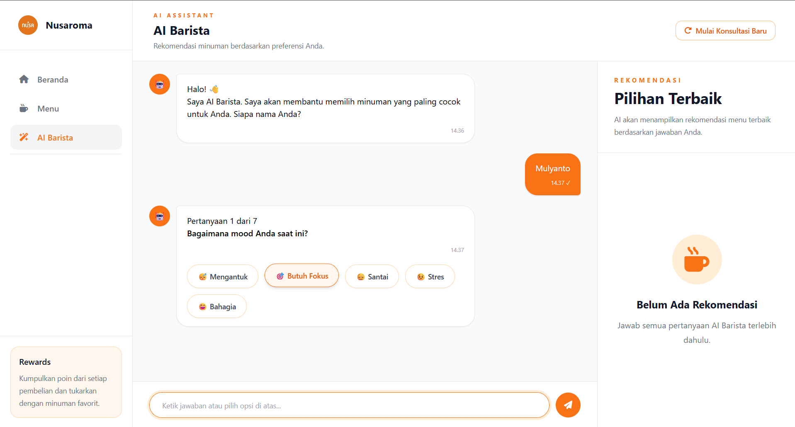
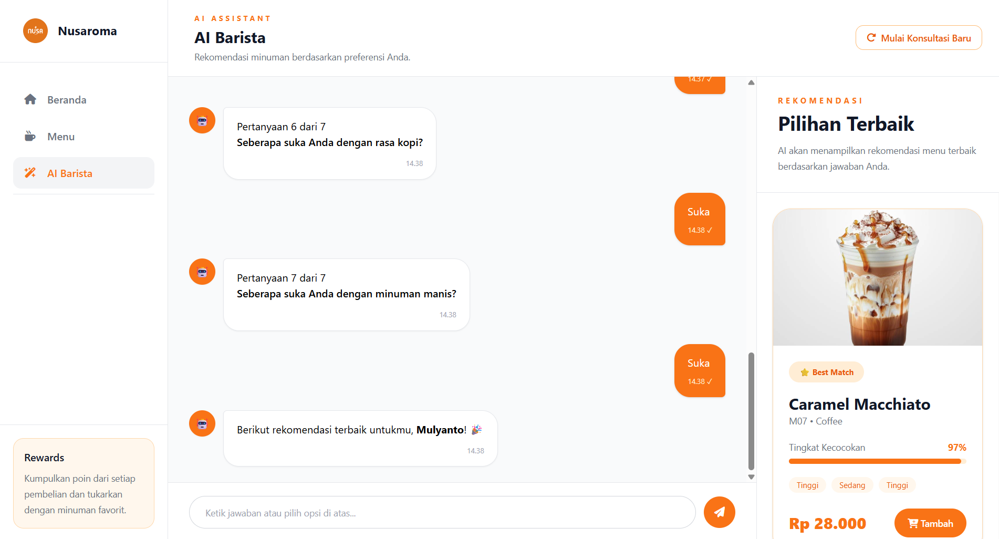
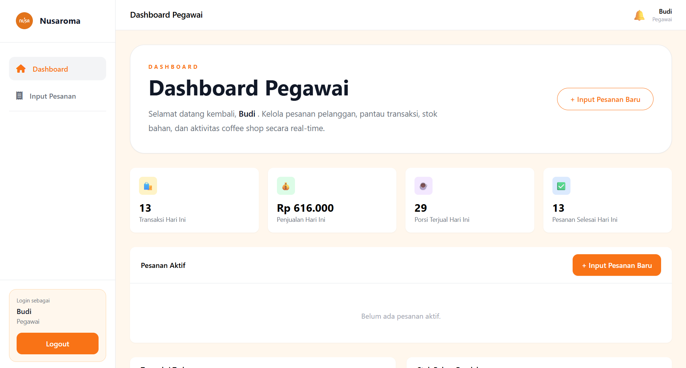
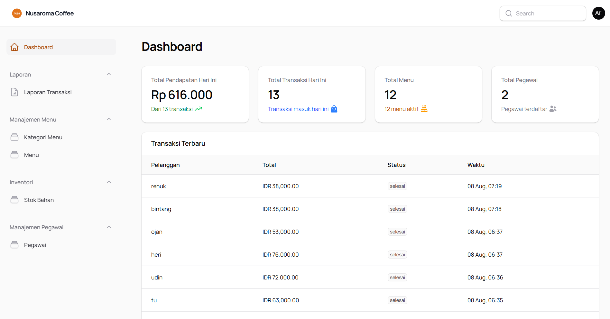

# 24g_laravel_sipakar_coffeshop
# ☕ Nusaroma Coffee

Aplikasi web pemesanan coffee shop berbasis Laravel dengan sistem rekomendasi minuman bertenaga AI (**AI Barista**), dibangun untuk kebutuhan Final Project mata kuliah Pemrograman Web.

Nusaroma Coffee melayani tiga peran pengguna dalam satu sistem: **Pelanggan** (memesan mandiri tanpa login), **Pegawai** (mengelola pesanan & kasir), dan **Admin** (mengelola data master, laporan, dan resep menu).

---

## ✨ Fitur Utama

### 🧑‍🤝‍🧑 Pelanggan (tanpa login)
- Jelajahi menu dengan filter kategori & pencarian
- **AI Barista** — konsultasi chat interaktif untuk mendapatkan rekomendasi minuman berdasarkan mood, cuaca, waktu, dan preferensi rasa (menggunakan metode **Forward Chaining** & **Certainty Factor**)
- Keranjang belanja & checkout (Tunai / QRIS)
- Cetak struk pesanan (format struk kasir 80mm)

### 👩‍🍳 Pegawai
- Login via email/password atau **Google OAuth**
- Dashboard real-time: statistik transaksi, penjualan, dan porsi terjual harian
- Kelola status pesanan (Menunggu → Diproses → Siap Diambil → Selesai)
- Input pesanan manual (untuk pelanggan yang memesan langsung di kasir)
- Cetak/cetak ulang struk pesanan

### 🛠️ Admin (Panel Filament)
- Kelola Kategori Menu, Menu (lengkap dengan resep bahan), Stok Bahan, dan Pegawai
- **Potong stok otomatis** setiap transaksi berdasarkan resep tiap menu
- Laporan Transaksi & Menu — unduh dalam format **Excel** dan **PDF**, dengan filter rentang tanggal
- Statistik dashboard: pendapatan harian, transaksi terbaru, dan peringatan stok bahan rendah

---

## 📸 Tampilan Aplikasi

### Beranda Pelanggan


### AI Barista (Chat Rekomendasi)



### Dashboard Pegawai


### Dashboard Admin


---

## 🧱 Tech Stack

| Kategori | Teknologi |
|---|---|
| Backend | Laravel 13, PHP 8.3 |
| Admin Panel | Filament v5 |
| Autentikasi | Laravel Breeze, Laravel Socialite (Google Login) |
| Database | MySQL |
| Laporan | Laravel Excel (`maatwebsite/excel`), Laravel DomPDF (`barryvdh/laravel-dompdf`) |
| Frontend | Tailwind CSS, Font Awesome, Font Manrope |

---

## 🚀 Instalasi & Menjalankan Project

### 1. Clone repository
```bash
git clone https://github.com/kampusriset/24g_laravel_sipakar_coffeshop.git
cd 24g_laravel_sipakar_coffeshop
```

### 2. Install dependency
```bash
composer install
npm install
```

### 3. Konfigurasi environment
```bash
cp .env.example .env
php artisan key:generate
```

Buka `.env`, sesuaikan koneksi database:
```env
DB_CONNECTION=mysql
DB_HOST=127.0.0.1
DB_PORT=3306
DB_DATABASE=nusaroma_coffee
DB_USERNAME=root
DB_PASSWORD=

SESSION_DRIVER=file
```

**(Opsional)** Untuk mengaktifkan Login Google, tambahkan juga:
```env
GOOGLE_CLIENT_ID=
GOOGLE_CLIENT_SECRET=
GOOGLE_REDIRECT_URI=http://127.0.0.1:8000/auth/google/callback
```
> Kredensial didapat dari [Google Cloud Console](https://console.cloud.google.com) → APIs & Services → Credentials.

### 4. Buat database kosong
Buat database baru sesuai nama di `DB_DATABASE` di atas (bisa lewat phpMyAdmin), biarkan kosong.

### 5. Jalankan migration & seeder
```bash
php artisan migrate:fresh --seed
php artisan storage:link
```

### 6. Build asset frontend
```bash
npm run build
```

### 7. Jalankan server
```bash
php artisan serve
```

Buka:
- `http://127.0.0.1:8000` — Halaman Pelanggan
- `http://127.0.0.1:8000/login` — Login Pegawai
- `http://127.0.0.1:8000/admin` — Panel Admin

---

## 🔑 Akun Default

| Peran | Email | Password |
|---|---|---|
| Admin | `admin@nusaromacoffee.com` | `admin12345` |
| Pegawai | `budi@nusaromacoffee.com` | `password123` |

> Halaman Pelanggan tidak memerlukan login sama sekali.

---

## 🧠 Metode AI Barista

Sistem rekomendasi menggunakan pendekatan **hybrid**:
1. **Forward Chaining** — menyaring kandidat menu berdasarkan mood, cuaca, waktu, dan jenis minuman yang dipilih pelanggan.
2. **Certainty Factor** — menghitung skor kecocokan tiap kandidat menu berdasarkan preferensi rasa pelanggan (susu, kopi, manis), lalu menampilkan 3 rekomendasi teratas.

---

## 👥 Tim Pengembang

| Nama | NIM | Peran |
|---|---|---|
| _(Muhammad Reza Alfauzi)_ | _(2413010698)_ | _(Backend Foundation & Autentikasi)_ |
| _(Bintang Ramadhan)_ | _(2413010700)_ | _(Admin Panel & Laporan)_ |
| _(Juane Verrell Alfreda)_ | _(2413010704)_ | _(AI Barista / FC & CF)_ |
| _(Foresco Moureno)_ | _(2413010696)_ | _(Halaman Pelanggan, Pegawai & Stok)_ |

---

## 📄 Lisensi

Project ini dibuat untuk keperluan akademik (Final Project/UAS).